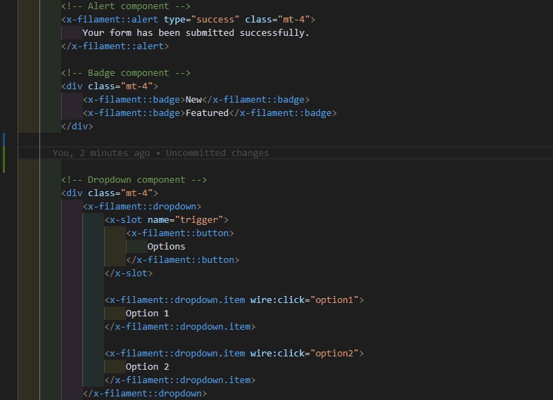

# Filament UI for VSCode

A Visual Studio Code extension that provides syntax highlighting and autocompletion for Laravel Filament UI components in Blade files.

## Features

- **Syntax Highlighting**: Properly highlights Filament UI components in Blade files without showing them as errors
- **Autocompletion**: Provides snippets for all Filament UI components with intelligent attribute suggestions
- **Tooltips**: Displays documentation for components and attributes in tooltips
- **Quick Start**: Begin typing `x-filament::` to see available components

## Support This Project

If you find Filament UI for VSCode useful, please consider supporting its development:

You can also become a GitHub sponsor: [Sponsor @doonfrs](https://github.com/sponsors/doonfrs)

Your support will encourage me to dedicate more time to keeping this useful package updated and well-documented.

## Supported Components

This extension provides full support for Filament UI components as documented in the [official Filament documentation](https://filamentphp.com/docs/3.x/support/blade-components/overview).

### UI Components

- `x-filament::avatar` - Displays user profile images
- `x-filament::badge` - Small colored labels for status or counts
- `x-filament::breadcrumbs` - Navigation path showing hierarchy
- `x-filament::loading-indicator` - Animated spinner for loading states
- `x-filament::section` - Content section with optional heading
- `x-filament::tabs` - Tabbed interface for content organization

### UI Components for Actions

- `x-filament::button` - Customizable action buttons
- `x-filament::dropdown` - Toggleable dropdown menus
- `x-filament::icon-button` - Icon-only buttons
- `x-filament::link` - Styled hyperlinks
- `x-filament::modal` - Dialog popup windows

### UI Components for Forms

- `x-filament::checkbox` - Checkbox input
- `x-filament::fieldset` - Groups related form inputs
- `x-filament::input` - Text input fields
- `x-filament::input.wrapper` - Wrapper for form inputs
- `x-filament::input.label` - Labels for form inputs
- `x-filament::input.error` - Error messages for form validation
- `x-filament::select` - Dropdown selection
- `x-filament::textarea` - Multi-line text input
- `x-filament::toggle` - Toggle switch input
- `x-filament::radio` - Radio button input

### UI Components for Tables

- `x-filament::pagination` - Navigation for paginated data

## Usage

1. Install the extension from the VSCode marketplace
2. Open a `.blade.php` file
3. Start typing `x-filament::` and the autocompletion will show the available components
4. Select a component to insert it with proper attributes and formatting
5. Tab through the placeholders to fill in the values

## Intelligent Autocompletion

This extension provides context-aware suggestions:

- Component-specific attributes are suggested when typing within a component tag
- Attribute values have intelligent dropdown options where appropriate (colors, sizes, etc.)
- Documentation is displayed in tooltips as you type

## Requirements

- Visual Studio Code 1.75.0 or higher

## Extension Settings

This extension doesn't add any VSCode settings.

## Known Issues

If you find any issues, please report them on the [GitHub repository](https://github.com/doonfrs/vscode-filament/issues).
